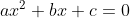
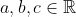
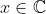

# Quadratic Equations

A quadratic equation is an equation in the form   , where    and   .

## Discriminant

The discriminant is the horizontal distance between the vertex of the parabola of a quadratic function and the roots of the equation (when the result of the function is 0). Its definition is:

  

## Roots

  
