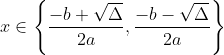

# Quadratic Equations

A quadratic equation is an equation in the form   , where    and   .

## Discriminant

In mathematics, the discriminant of a polynomial is a quantity that depends on the coefficients and determines various properties of the roots. Its definition is:

  

## Roots

  
